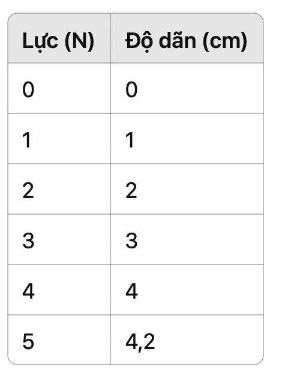

ĐỀ KIỂM TRA THỬ CUỐI KỲ SỐ 2 – VẬT LÝ 10
Thời gian làm bài: 45 phút

Họ và tên:……………………………………………….  Lớp:………………..

⸻

Phần 1: Trắc nghiệm khách quan (3,0 điểm)

Khoanh tròn vào chữ cái đứng trước đáp án đúng nhất.

Câu 1: Công suất có đơn vị là:
A. N/m
B. J·s
C. W (Watt) ✅
D. kg·m/s²

Câu 2: Động năng của một vật được tính bằng:
A. W = F·s
B. W = mgh
C. W = 1/2·mv² ✅
D. W = p·v

Câu 3: Một vật chuyển động tròn đều thì lực hướng tâm luôn:
A. Vuông góc với gia tốc
B. Cùng chiều với vận tốc
C. Hướng về tâm quỹ đạo ✅
D. Hướng ra ngoài

Câu 4: Momen lực phụ thuộc vào:
A. Độ lớn lực và khối lượng
B. Góc quay
C. Lực và khoảng cách đến trục quay ✅
D. Tốc độ quay

Câu 5: Khối lượng riêng phụ thuộc vào:
A. Trọng lượng và lực
B. Khối lượng và thể tích ✅
C. Thể tích và gia tốc
D. Khối lượng và chiều dài

Câu 6: Biểu thức lực đàn hồi của lò xo là:
A. F = m·a
B. F = k·x ✅
C. F = P·V
D. F = v²/r

Câu 7: Khi một vật rơi tự do, cơ năng của vật:
A. Không đổi ✅
B. Giảm dần
C. Tăng dần
D. Bằng 0

Câu 8: Trong chuyển động tròn đều, tốc độ góc ω có đơn vị là:
A. rad
B. rad/s ✅
C. m/s
D. m/s²

Câu 9: Trong va chạm mềm:
A. Cả động lượng và năng lượng đều bảo toàn
B. Động lượng bảo toàn, năng lượng không bảo toàn ✅
C. Năng lượng bảo toàn, động lượng không
D. Không có đại lượng nào bảo toàn

Câu 10: Khi vật bị nén hoặc kéo, nếu lực tỷ lệ với độ biến dạng thì:
A. Vật đàn hồi ✅
B. Vật cứng
C. Vật biến dạng dẻo
D. Vật thay đổi khối lượng

Câu 11: Trong hệ kín, định luật bảo toàn động lượng áp dụng khi:
A. Có lực ma sát
B. Không có lực ngoài tác dụng ✅
C. Vật đứng yên
D. Vật rơi tự do

Câu 12: Chuyển động tròn đều là chuyển động có:
A. Gia tốc không đổi
B. Vận tốc không đổi
C. Tốc độ không đổi ✅
D. Lực không đổi

Phần 2: Đúng – Sai (1,0 điểm)

Câu 1: Đánh dấu Đ nếu đúng, S nếu sai.
	1.	Động năng của vật có thể bằng 0 khi vật đứng yên. (Đ)
	2.	Khi lực kéo tác dụng lên vật lớn hơn trọng lực, vật rơi nhanh hơn. (S)
	3.	Lực hướng tâm luôn vuông góc với vận tốc. (Đ)
	4.	Trong va chạm đàn hồi, tổng động lượng không đổi. (Đ)
Câu 2: Đánh dấu Đ nếu đúng, S nếu sai.
	1.	Từ phương trình p = m.v có thể suy ra công của lực bằng động năng của vật khi vận tốc ban đầu bằng 0. (S)
	2.	Vec tơ vận tốc chuyển động tròn đều luôn vuông óc với bán kính quỹ đạo (Đ)
	3.	Khi vật rơi từ trên xuống dưới và có sức cản không khí thì cơ năng luôn bảo toàn (S)
	4.	Biểu thức của cơ năng là W = W_t + W_đ

Phần 3: Tự luận ngắn (2,0 điểm)

Câu 1: Một lực 15 N tác dụng vuông góc vào một cánh tay đòn dài 0,2 m. Tính moment lực.

Câu 2: Một vật khối lượng 2 kg chuyển động với vận tốc 3 m/s. Tính động năng.

Câu 3: Một vật chuyển động tròn đều, đi được cung 31,4 cm, bán kính quỹ đạo là 5 cm. Tính góc quay (rad).

Câu 4: Một xe quay quanh vòng tròn bán kính 20 m với tốc độ 5 m/s. Tính gia tốc hướng tâm.

Phần 4: Tự luận (3,0 điểm)

Câu 1:
Một xe A khối lượng 1 kg chuyển động với vận tốc 4 m/s va vào xe B khối lượng 2 kg đứng yên. Sau va chạm, hai xe dính vào nhau.
a) Tính vận tốc sau va chạm.
b) So sánh động năng trước và sau va chạm.

Câu 2:
a) Một vật chuyển động tròn đều, đi hết cung bằng 2 lần bán kính. Xác định góc quay (rad).
b) Xe 1000 kg chạy quanh đường tròn bán kính 40 m với tốc độ 10 m/s. Tính lực hướng tâm.

Câu 3:
Dưới đây là bảng số liệu đo lực và độ dãn:

a) Nhận xét về tính đàn hồi, xác định giới hạn đàn hồi.
b) Tính độ cứng k.